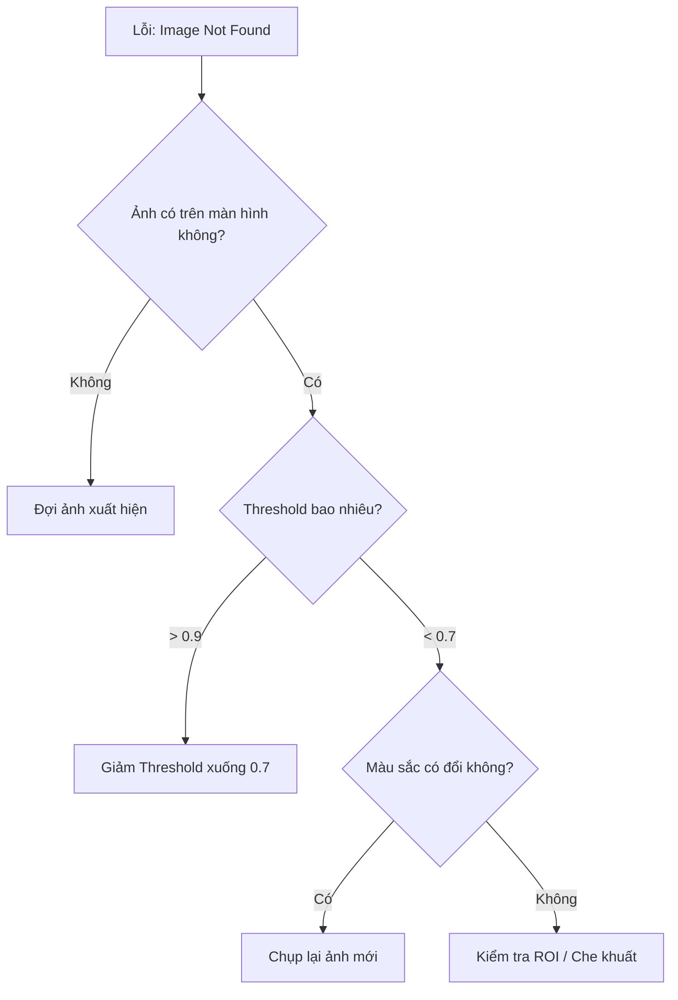

# Part 1: The Launchpad (Bệ phóng) 🚀
> *Từ Zero đến Hero trong 30 phút*

---

## 1.1 Prerequisites & Environment (Tiền điều kiện)

Trước khi cài đặt RetroAuto, hãy đảm bảo môi trường Windows của bạn đã được cấu hình đúng. **60% lỗi "Image not found"** đến từ việc bỏ qua bước này.

### ✅ Checklist Bắt buộc

| # | Mục | Cách kiểm tra | Tại sao quan trọng? |
|---|-----|---------------|---------------------|
| 1 | **DPI Scaling = 100%** | Settings → Display → Scale = 100% | Pixel coordinates bị lệch nếu scale khác 100% |
| 2 | **Admin Rights** | Chuột phải → "Run as Administrator" | Một số game chặn input từ app không có quyền Admin |
| 3 | **Borderless Windowed** | Trong game: Settings → Display → Borderless | Fullscreen chặn screenshot/input từ bên ngoài |
| 4 | **Night Light OFF** | Settings → Display → Night Light = Off | Màu sắc bị biến đổi làm hỏng image matching |

### 🖥️ Multi-Monitor Setup

Nếu bạn có nhiều màn hình:
- **Tọa độ (0, 0):** Luôn ở góc trên-trái của màn hình CHÍNH (Primary).
- **Màn hình phụ:** Có thể có tọa độ âm (ví dụ: `-1920, 0` nếu nằm bên trái).
- **Khuyến nghị:** Chạy game trên màn hình chính để tránh rắc rối.

### ⚡ Power Settings

Nếu bạn chạy bot qua đêm:
```
Settings → Power & Sleep → Screen: Never | Sleep: Never
```
Hoặc: Download công cụ "Caffeine" để giữ máy tỉnh.

---

## 1.2 Quickstart: "The 5-Minute Bot" ⏱️

> **Goal:** Viết bot tự động search Google trong 5 phút.
> **Yêu cầu:** Đã cài Python 3.11+, pip.

### Bước 1: Cài đặt (2 phút)

```powershell
# Clone hoặc download RetroAuto
cd C:\Auto\Newauto

# Cài dependencies
pip install -r requirements.txt
```

### Bước 2: Chạy App (30 giây)

```powershell
python -m app.main
```

Cửa sổ RetroAuto sẽ hiện ra với 3 panel: **Assets | Actions | Properties**.

### Bước 3: Tạo Script đầu tiên (2 phút)

1. **Thêm Action "Click":**
   - Bấm nút `+ Click` trên Quick Add Bar.
   - Trong Properties: Nhập `x=500, y=300` (vị trí search box của Google, bạn tự điều chỉnh).

2. **Thêm Action "TypeText":**
   - Bấm `+ Type`.
   - Trong Properties: `text="Hello RetroAuto"`, `enter=true`.

3. **Save & Run:**
   - `Ctrl+S` để lưu.
   - `F5` để chạy.

### 🎉 Kết quả

Nếu bạn đang mở trình duyệt với Google, con trỏ sẽ click vào ô search và gõ "Hello RetroAuto" + Enter.

**Chúc mừng! Bạn đã viết bot đầu tiên.** 🎊

---

## 1.3 Installation & Dependencies

### Yêu cầu hệ thống

| Component | Version | Ghi chú |
|-----------|---------|---------|
| OS | Windows 10/11 | Chưa hỗ trợ Linux/macOS |
| Python | 3.11+ | Khuyến nghị 3.12 |
| RAM | 4GB+ | 8GB nếu dùng OCR nặng |
| Tesseract | 5.x (Optional) | Cho tính năng OCR |

### Cài đặt chi tiết

```powershell
# 1. Clone repo
git clone https://github.com/your-repo/retroauto.git
cd retroauto

# 2. Tạo virtual environment (khuyến nghị)
python -m venv .venv
.venv\Scripts\activate

# 3. Cài dependencies
pip install -r requirements.txt

# 4. (Optional) Cài Tesseract cho OCR
# Download từ: https://github.com/UB-Mannheim/tesseract/wiki
# Cài vào: C:\Program Files\Tesseract-OCR
```

### Cấu trúc thư mục

```
retroauto/
├── app/            # UI code (PySide6)
├── core/           # Engine, DSL parser, Runner
├── infra/          # Logging, Crash handler
├── assets/         # Image templates (bạn lưu ở đây)
├── scripts/        # Saved scripts (.retro files)
└── docs/           # Tài liệu này
```

---

## 1.4 Interface Tour (Khám phá giao diện)

### Main Window (Cửa sổ chính)

```
┌─────────────────────────────────────────────────────────┐
│  [Toolbar: Run | Pause | Stop | Capture | IDE | Save]   │
├──────────┬─────────────────────────┬────────────────────┤
│  Assets  │       Actions           │    Properties      │
│  Panel   │       Panel             │    Panel           │
│          │                         │                    │
│ 📷 img1  │ 1. Click(100, 200)      │ Action: Click      │
│ 📷 img2  │ 2. WaitImage("img1")    │ x: [100]           │
│          │ 3. TypeText("Hello")    │ y: [200]           │
│          │                         │ button: [left ▼]   │
└──────────┴─────────────────────────┴────────────────────┘
```

- **Assets Panel (Trái):** Quản lý hình ảnh mẫu.
- **Actions Panel (Giữa):** Danh sách hành động (Flow).
- **Properties Panel (Phải):** Chỉnh sửa tham số action đang chọn.

### IDE Window (Cửa sổ Code)

Bấm nút **IDE** trên toolbar để mở chế độ viết code:

```
┌─────────────────────────────────────────────────────────┐
│  [Toolbar: Run | Save | Format]                         │
├──────────┬─────────────────────────────────────┬────────┤
│ Structure│         Code Editor                 │Minimap │
│ Panel    │                                     │        │
│          │ @main:                              │ ░░░░░░ │
│ ▶ @main  │     click(100, 200)                 │ ░░░    │
│ ▶ @heal  │     wait_image("btn_ok")            │ ░░░░   │
│          │     run_flow("heal")                │        │
└──────────┴─────────────────────────────────────┴────────┘
```

- **Structure Panel (Trái):** Outline của flows và labels.
- **Code Editor (Giữa):** Viết DSL với Intellisense.
- **Minimap (Phải):** Nhìn tổng quan code, click để nhảy.

---

> 👉 **Tiếp theo:** [Part 3: The Cookbook](./cookbook.md) - Học qua các bài thực hành thực tế.
# Part 2: The Core (Nguyên Lý Cốt Lõi) 🧠
> *Hiểu sâu để làm chủ.*

Để viết được script ổn định, bạn cần hiểu cách RetroAuto "nhìn" và "nghĩ".

---

## 2.1 The Execution Model (Cơ chế hoạt động)

RetroAuto không chạy mọi thứ cùng lúc. Nó có một "nhịp tim" (Event Loop) xử lý công việc theo thứ tự.

### Synchronous vs Asynchronous (Tuần tự vs Song song)

#### 1. Main Thread (Tuần tự - Synchronous)
Đây là luồng chính nơi `script` của bạn chạy. Lệnh này xong mới đến lệnh kia.
- **Ví dụ:** `click`, `wait_image`, `sleep`.
- **Đặc điểm:** Nếu bạn dùng `wait_image(timeout=infinite)`, bot sẽ **đứng yên mãi mãi** cho đến khi ảnh xuất hiện. Đây là hành vi "Blocking".

#### 2. Interrupts (Song song - Asynchronous)
Đây là "giác quan thứ 6" của bot. Nó chạy song song với Main Thread.
- **Cơ chế:** Cứ mỗi `500ms` (mặc định), hệ thống sẽ quét màn hình một lần để tìm các ảnh trong danh sách Rules.
- **Priority (Độ ưu tiên):** Nếu tìm thấy ảnh Interrupt (ví dụ: màn hình Login), bot sẽ:
    1.  **PAUSE** script chính ngay lập tức.
    2.  Chạy Action/Flow của Interrupt (ví dụ: Đăng nhập lại).
    3.  **RESUME** script chính từ điểm bị dừng.

> 📐 **Diagram: Interrupt Cycle**
> ```
> [Main Script] ---> Click ---> Wait ---> [PAUSED] ................... [RESUME] ---> Click...
>                                           ⬇                             ⬆
> [Interrupt Monitor] ----------------> [Detect Login] --> [Run LoginFlow] ⤴
> ```

---

## 2.2 The Coordinate System (Hệ tọa độ) 🗺️

RetroAuto sử dụng hệ tọa độ pixel của màn hình Windows.

### Global Coordinates (Tọa độ toàn cục)
- **Gốc (0, 0):** Góc trên cùng bên trái của màn hình chính.
- **X:** Tăng dần sang phải.
- **Y:** Tăng dần xuống dưới.

> ⚠️ **Lưu ý Multi-monitor:** Màn hình phụ có thể có tọa độ âm. Hãy luôn dùng công cụ **Capture Tool** (F2) hoặc **Cursor Info** để lấy tọa độ chính xác.

### ROI (Region of Interest - Vùng quan tâm)
Tìm kiếm trên toàn màn hình (1920x1080) rất chậm và dễ sai. Hãy dùng ROI để giới hạn vùng tìm kiếm.

- **Ví dụ:** Chỉ tìm thanh máu ở góc trái trên.
- **Lợi ích:**
    1.  **Tốc độ:** Nhanh gấp 5-10 lần.
    2.  **Chính xác:** Tránh nhận diện nhầm icon giống nhau ở chỗ khác.

---

## 2.3 Assets & Recognition (Nhận diện hình ảnh) 👁️

### Template Matching (Khớp mẫu)
RetroAuto dùng thuật toán OpenCV để trượt ảnh mẫu (`template`) trên màn hình (`source`).

### Threshold (Độ tương đồng)
Kết quả khớp trả về một con số từ `0.0` đến `1.0`.
- **1.0:** Giống tuyệt đối.
- **0.9:** Rất giống (Chấp nhận được).
- **0.7:** Khá giống (Mặc định).
- **< 0.5:** Không giống.

> 💡 **Best Practice:**
> - Icon tĩnh, nét: `0.9`
> - Hình trong game 3D (ánh sáng đổi): `0.7 - 0.8`
> - Văn bản (nếu không dùng OCR): `0.8`

### Grayscale vs Color
- **Mặc định:** RetroAuto so sánh ở chế độ **Grayscale** (Đen trắng) để tối ưu tốc độ.
- **Use Color:** Nếu bạn cần phân biệt 2 bình máu giống hệt nhau về hình dạng nhưng khác màu (Đỏ vs Xanh), hãy bật `match_color=true` (Tính năng nâng cao).

---

> 👉 **Tiếp theo:** [Part 4: The Tools](./tools_mastery.md) - Làm chủ công cụ IDE và GUI.
# Part 3: The Cookbook (Món Ngon Thực Chiến) 🍳
> *Học qua hành động. Copy, Paste, và Chạy.*

Chào mừng bạn đến với "Căn bếp Automation". Tại đây, chúng ta sẽ không nói lý thuyết suông. Bạn sẽ học cách nấu những "món ăn" (script) phổ biến nhất mà bất kỳ pro-gamer hay operator nào cũng cần.

---

## 🥗 Recipe 1: The Login Guard (Hộ Vệ Đăng Nhập)
**Level:** 🟢 Dễ | **Time:** 5 phút | **Concept:** Interrupts (Sự kiện)

### Vấn đề
Game online hay bị disconnect (mất mạng) hoặc văng game khi treo máy đêm. Bạn muốn bot tự động đăng nhập lại khi thấy màn hình login.

### Nguyên liệu
1.  Ảnh `screen_login.png`: Màn hình đăng nhập.
2.  Ảnh `btn_start.png`: Nút "Vào game".
3.  Flow "LoginFlow": Chuỗi hành động để đăng nhập.

### Cách chế biến (Step-by-Step)

#### Bước 1: Tạo Flow Đăng Nhập (`LoginFlow`)
Vào `Flow Editor`, tạo một flow mới tên `LoginFlow`:

```retroscript
@LoginFlow:
    # 1. Chờ nút Start xuất hiện (phòng khi máy chậm)
    wait_image("btn_start", timeout=10s)

    # 2. Click vào nút Start
    click_image("btn_start")

    # 3. Chờ loading xong (Loading screen biến mất)
    wait_image("screen_loading", appear=false, timeout=60s)

    # 4. Thông báo đã vào lại game
    notify("Reconnected successfully!", method=popup)
```

#### Bước 2: Cài Đặt "Hộ Vệ" (Interrupt Rule)
Chúng ta không muốn viết lệnh `check_login` vào mọi nơi trong script chính (Farming). Hãy dùng tính năng **Interrupts** (Tương tự như phản xạ không điều kiện).

1.  Chuyển sang tab **⚡ Interrupts**.
2.  Bấm `Add Rule`.
3.  **Trigger Image:** Chọn `screen_login.png`.
4.  **Action:** Run Flow -> `LoginFlow`.
5.  **Priority:** `High (P10)` (Ưu tiên cao nhất, dừng mọi việc khác để login).
6.  **Cooldown:** `30s` (Để tránh spam login liên tục).

### 🎯 Kết quả
Bây giờ, dù bạn đang farm quái ở Flow nào, chỉ cần màn hình Login hiện ra, RetroAuto sẽ **ngay lập tức** tạm dừng việc farm, chạy `LoginFlow` để vào lại game, rồi tiếp tục farm.

---

## 🍲 Recipe 2: The Infinite Farming Loop (Vòng Lặp Vô Tận)
**Level:** 🟡 Trung Bình | **Time:** 10 phút | **Concept:** Logic & State

### Vấn đề
Bạn muốn nhân vật tự tìm quái, đánh quái, nhặt đồ. Khi máu thấp (< 50%) thì tự bơm máu. Khi túi đầy thì tự về thành bán đồ.

### Nguyên liệu
-   `monster.png`: Quái vật.
-   `hp_low.png`: Thanh máu khi cạn (màu đỏ nhạt).
-   `inventory_full.png`: Thông báo túi đầy.

### Cách chế biến

Hãy viết script dạng DSL (IDE Mode) để dễ quản lý logic phức tạp.

```retroscript
@main:
    # Vòng lặp chính vô tận
    loop 999999:

        # 1. Kiểm tra an toàn trước
        run_flow("SafetyCheck")

        # 2. Tìm quái
        if_image("monster"):
            # Tìm thấy quái -> Đánh
            click_image("monster")

            # Đợi đánh xong (Ví dụ: chờ thanh exp hiện lên hoặc quái biến mất)
            wait_image("monster", appear=false, timeout=10s)

            # Nhặt đồ (Loop nhặt 3 lần cho chắc)
            loop 3:
                hotkey("Space") # Phím nhặt đồ
                sleep(200ms)
        else:
            # Không thấy quái -> Tìm góc khác hoặc xoay camera
            hotkey("Tab")
            sleep(1s)

        # 3. Giả lập nghỉ ngơi (Anti-ban)
        delay_random(500, 1500)

@SafetyCheck:
    # 1. Bơm máu (Logic sinh tồn)
    if_image("hp_low"):
        hotkey("F1") # Phím bình máu
        sleep(500ms)

    # 2. Check túi đầy (Logic tài nguyên)
    if_image("inventory_full"):
        notify("Inventory full! Going home...", method=telegram)
        run_flow("GoHomeAndSell") # Flow về thành (bạn tự define nhé)
```

### 💡 Bí kíp của Đầu bếp (Chef's Tips)

1.  **Đừng check `hp_low` liên tục trong main loop:** Hãy tách ra thành `@SafetyCheck` để code gọn gàng.
2.  **Anti-Ban:** Luôn dùng `delay_random` thay vì `sleep` cố định. Game master rất ghét những ai bấm nút đều như vắt chanh (vd: đúng 1000ms mỗi lần).
3.  **Fail-safe:** Luôn có `timeout` cho `wait_image`. Đừng để bot chờ mãi mãi một hình ảnh có thể không bao giờ hiện (ví dụ: lag game làm mất hình quái).

---

> 👉 **Bài tập về nhà:** Hãy thử kết hợp Recipe 1 và Recipe 2. Chạy Farming Loop và rút dây mạng ra để test xem Login Guard có hoạt động không nhé!
# Part 4: The Tools (Làm Chủ Công Cụ) 🛠️
> *Thợ giỏi nhờ đồ nghề. Hướng dẫn chi tiết 100% các bảng điều khiển.*

RetroAuto cung cấp 2 chế độ làm việc: **GUI Mode** (Kéo thả) và **IDE Mode** (Viết code).

---

## 4.1 GUI Mode Mastery (Chế Độ Đồ Họa)

### 1. The 3-Panel Layout (Bố cục 3 Bảng)

#### A. Assets Panel (Trái - Tài nguyên)
Nơi quản lý "đôi mắt" của bot - các hình ảnh mẫu.
- **Import:** Kéo thả file ảnh `.png` từ Windows Explorer vào đây.
- **Capture (F2):** Bấm nút máy ảnh hoặc `F2` để cắt ảnh trực tiếp từ màn hình.
- **Context Menu (Chuột phải):**
    - `Rename`: Đổi tên ID (Lưu ý: Tên ID dùng trong code).
    - `Delete`: Xóa ảnh (Cảnh báo: Nếu code đang dùng ảnh này sẽ bị lỗi).
    - `Copy Path`: Lấy đường dẫn file.

#### B. Actions Panel (Giữa - Kịch bản)
Trái tim của Automation. Chứa danh sách các bước thực hiện.

**Action Categories (Phân loại):**
1.  **🎯 Clicks & Mouse:** `Click`, `ClickImage`, `Drag`, `Scroll`...
2.  **👁️ Vision & Wait:** `WaitImage`, `IfImage`, `WhileImage`, `ReadText`...
3.  **⌨️ Keyboard:** `TypeText`, `Hotkey`.
4.  **⏱️ Timing:** `Delay`, `DelayRandom`.
5.  **🔄 Flow Control:** `Loop`, `Label`, `Goto`, `RunFlow`.
6.  **📡 Notify:** `Notify` (Popup/Telegram).

**Thao tác:**
- **Thêm Action:** Dùng **Quick Add Bar** ở trên cùng hoặc kéo thả từ menu.
- **Sắp xếp:** Kéo thả (Drag & Drop) để đổi thứ tự.
- **Disable:** Chuột phải -> `Disable` để tạm tắt 1 dòng lệnh (Sẽ hiện màu xám).
- **Clone:** Chuột phải -> `Duplicate` để nhân bản.

#### C. Properties Panel (Phải - Tham số)
Chỉnh sửa chi tiết cho Action đang chọn.
- **Dynamic Fields:** Ô nhập liệu thay đổi theo loại Action.
    - `Click`: Có ô `x`, `y`, `button`.
    - `WaitImage`: Có ô `asset_id`, `timeout`.
- **Validation:** Viền đỏ nếu nhập sai (ví dụ: nhập chữ vào ô số).

---

## 4.2 IDE Mode Mastery (Chế Độ Code)

Bấm nút **IDE** trên Toolbar để chuyển sang giao diện lập trình.

### 1. Structure Panel (Cấu trúc)
Cột bên trái hiển thị outline của script.
- **▶ @Flows:** Danh sách các hàm (Function).
- **🏷️ #Labels:** Các điểm neo (Marker) để `goto`.
- **Double-click:** Để nhảy ngay đến dòng code đó.

### 2. The Code Editor (Soạn thảo)
Trình soạn thảo RetroScript mạnh mẽ với hỗ trợ:

- **Intellisense (Gợi ý):**
    - Gõ `c` -> Gợi ý `click`, `click_image`.
    - Gõ `"` -> Gợi ý danh sách ảnh (`"btn_ok"`, `"icon_hp"`).
    - Phím tắt: `Ctrl+Space`.

- **Signature Help (Nhắc tham số):**
    - Gõ `click(` -> Tooltip hiện: `x: int, y: int, button: str`.

- **Syntax Highlighting:**
    - **Xanh dương:** Lệnh (Verb).
    - **Cam:** Chuỗi/ID.
    - **Tím:** Số.
    - **Xám:** Comment (`#`).

### 3. Minimap (Bản đồ)
Dải bên phải giúp nhìn tổng quan code dài.
- **Màu sắc:** Phân biệt các khối lệnh `Loop`, `If`.
- **Click:** Cuộn nhanh đến vị trí.

---

## 🛑 Keyboard Shortcuts (Phím Tắt Toàn Tập)

| Phím (Global) | Chức năng | Hành vi |
|---------------|-----------|---------|
| **F5** | Run Script | Chạy script hiện tại từ đầu (Main Flow) |
| **F6** | Pause/Resume | Tạm dừng bot để check, bấm lại để chạy tiếp |
| **F8** | **STOP (Khẩn cấp)** | Dừng mọi hoạt động ngay lập tức (Kill Switch) |
| **F2** | Capture Tool | Mở công cụ chụp màn hình |

| Phím (Editor) | Chức năng |
|---------------|-----------|
| **Ctrl+S** | Lưu Script |
| **Ctrl+Space** | Gợi ý code (Autocompletion) |
| **Ctrl+Shift+Space** | Xem tham số hàm (Signature Help) |
| **Ctrl+/** | Comment/Uncomment dòng |
| **Ctrl+Z** | Undo (Hoàn tác) |
| **Ctrl+Y** | Redo (Làm lại) |
# Part 5: Deep Dive (Chuyên Sâu) 🔬
> *Vượt qua giới hạn cơ bản.*

---

## 5.1 Hawk Eye OCR System (Hệ thống đọc chữ)
Ngoài việc nhìn hình ảnh, RetroAuto có thể "đọc" chữ số (máu, vàng, tên nhân vật).

### Cấu hình Tesseract
Để dùng OCR, bạn cần chỉ định đường dẫn Tesseract trong `Settings` hoặc code:
```retroscript
# Cấu hình OCR engine
ocr_config(lang="eng", psm=7, whitelist="0123456789/")
```
- **psm (Page Segmentation Mode):**
    - `7`: Coi ảnh là một dòng văn bản đơn (Tốt nhất cho thanh máu/tên).
    - `3`: Tự động nhận diện (Mặc định).
- **whitelist:** Chỉ cho phép đọc các ký tự này (Giúp tránh đọc nhầm `O` thành `0`).

### Text Logic
```retroscript
# Đọc % máu tại vùng [100, 100, 50, 20]
read_text("$hp_str", region=[100, 100, 50, 20])

# So sánh logic
if_text("$hp_str", "<", "50"):
    hotkey("F1")
```

---

## 5.2 Human Mouse (Anti-Ban Tech) 🕵️
Game Master (GM) phát hiện bot bằng cách nào? Họ xem log di chuyển chuột.
- ❌ **Robotic:** Di chuyển thẳng tắp, tốc độ không đổi -> **BAN**.
- ✅ **Human:** Đường cong Bezier, tốc độ thay đổi (nhanh ở giữa, chậm dần khi đến đích), run tay (jitter).

### Cách sử dụng
RetroAuto mặc định kích hoạt Human Mouse cho lệnh `move()` và `drag()`.
```retroscript
# Tự động sinh đường cong ngẫu nhiên
click(500, 500)

# Tùy chỉnh độ "người"
mouse_config(speed_min=0.5, speed_max=1.0, deviation=5)
```

---

## 5.3 Global Interrupts Architecture
Một script RetroAuto thực chất chạy **2 luồng song song**:

1.  **Main Flow:** Logic chính (Farm quái). Chạy tuần tự.
2.  **Interrupt Sentinel:** Lính canh. Chạy ngầm mỗi 500ms.

### Priority System (Hệ thống ưu tiên)
Điều gì xảy ra nếu vừa thấy "Máu thấp" (P10) vừa thấy "Túi đầy" (P5)?
-> **P10 thắng.** Script sẽ chạy Flow bơm máu trước.

### Cooldown (Hồi chiêu)
Để tránh việc bot bấm hồi máu liên tục 100 lần/giây, mỗi Interrupt Rule có `cooldown`.
- Ví dụ: `Reconnect` có cooldown `60s`. Nếu vừa reconnect xong mà lại thấy nút login, bot sẽ đợi hết 60s mới bấm tiếp.

---

> 👉 **Tiếp theo:** [Part 6: Troubleshooting](./troubleshooting.md) - Sơ đồ chẩn đoán lỗi.
# Part 7: Reference Manual (Từ Điển Lệnh) 📚
> *Tra cứu mọi chức năng. Không bỏ sót bất kỳ lệnh nào.*

Tài liệu này liệt kê đầy đủ 100% các lệnh được hỗ trợ trong RetroAuto v2, tương ứng với mã nguồn `tokens.py` và `actions_panel.py`.

---

## 7.1 🎯 Clicks & Mouse (Thao tác Chuột)

### `click(x, y, button="left", double=False)`
Click vào một tọa độ màn hình cố định.
- **x, y:** Tọa độ pixel (số nguyên).
- **button:** `"left"`, `"right"`, `"middle"`.
- **double:** `True` để double-click.

### `click_image(asset_id, button="left", timeout=0, double=False)`
Tìm ảnh và click vào tâm ảnh đó.
- **asset_id:** ID của tài nguyên (ví dụ: `"btn_ok"`).
- **timeout:** Thời gian chờ ảnh xuất hiện (giây). 0 = không chờ.
- **Ex:** `click_image("btn_start", timeout=5s)`

### `click_random(x1, y1, x2, y2)`
Click ngẫu nhiên trong vùng hình chữ nhật (Chống ban).
- **x1, y1:** Góc trên-trái.
- **x2, y2:** Góc dưới-phải.
- **Ex:** `click_random(100, 100, 200, 200)`

### `click_until(target_id, stop_id, max_clicks=10)`
Click liên tục vào `target_id` cho đến khi `stop_id` xuất hiện.
- **Ex:** `click_until("btn_next", "screen_page2")` (Click Next cho đến khi sang trang 2).

### `drag(x1, y1, x2, y2, duration=500)`
Kéo chuột từ A đến B (Swipe/Drop).
- **duration:** Thời gian kéo (ms).

### `scroll(dx, dy)`
Cuộn chuột.
- **dx:** Cuộn ngang (thường là 0).
- **dy:** Cuộn dọc. Dương = Lên, Âm = Xuống.
- **Ex:** `scroll(0, -500)` (Cuộn xuống dưới).

---

## 7.2 👁️ Vision & Wait (Thị giác)

### `wait_image(asset_id, timeout=infinite, appear=True)`
Dừng script cho đến khi ảnh xuất hiện (hoặc biến mất).
- **appear:** `True` (chờ hiện), `False` (chờ mất).
- **Ex:** `wait_image("loading_spinner", appear=False)` (Chờ loading xong).

### `wait_pixel(x, y, color, tolerance=10)`
Chờ một điểm pixel có màu cụ thể.
- **color:** Mã màu Hex (`#FF0000`) hoặc RGB tuple.

### `if_image(asset_id, region=None)`
Trả về `True` nếu ảnh có trên màn hình. Dùng trong khối `if`.
- **region:** `[x, y, w, h]` để giới hạn vùng tìm kiếm (Tăng tốc độ).

### `while_image(asset_id)`
Lặp lại khối lệnh MIỄN LÀ ảnh còn trên màn hình.
- **Ex:** `while_image("enemy"): attack()`

### `if_pixel(x, y, color)`
Giống `if_image` nhưng kiểm tra màu của 1 pixel.

### `read_text(variable, region)`
Đọc văn bản từ màn hình (OCR) và lưu vào biến.
- **variable:** Tên biến (vd: `"$hp"`).
- **region:** Vùng cần đọc `[x, y, w, h]`.
- **Ex:** `read_text("$gold", [10, 10, 100, 20])`

---

## 7.3 ⌨️ Keyboard & Input (Bàn phím)

### `type_text(text, interval=0, enter=False)`
Gõ văn bản như người dùng.
- **interval:** Độ trễ giữa các phím (ms).
- **enter:** Nhấn Enter cuối cùng.

### `hotkey(sequence)`
Gửi tổ hợp phím.
- **Ex:** `"Ctrl+C"`, `"Alt+F4"`, `"Win+R"`.

---

## 7.4 ⏱️ Timing & Delays (Thời gian)

### `delay(amount, random=False)` / `sleep()`
Dừng script.
- **amount:** `1s`, `500ms`.

### `delay_random(min_ms, max_ms)`
Dừng ngẫu nhiên (Quan trọng cho Anti-ban).

---

## 7.5 🔄 Flow Control (Điều khiển luồng)

### `if`, `elif`, `else`, `endif`
Cấu trúc rẽ nhánh điều kiện.
```retroscript
if_image("A"):
    click("A")
else:
    click("B")
```

### `loop n` / `endloop`
Lặp số lần cố định. `loop 0` hoặc không tham số = Lặp vô hạn.

### `run_flow(name)`
Gọi một Flow khác (Sub-routine).

### `goto(label)` / `label(name)`
Nhảy đến vị trí được đánh dấu.

### `if_text(variable, operator, value)`
So sánh giá trị văn bản/số.
- **operator:** `"=="`, `"!="`, `">"`, `"<"`, `"contains"`.
- **Ex:** `if_text("$hp", "<", 50)`

---

## 7.6 📡 Remote & Notify

### `notify(message, method="popup")`
Gửi thông báo.
- **method:** `"popup"` (Mặc định), `"telegram"`, `"discord"`, `"sound"`.

---

## 🧱 Cấu trúc DSL (Internal)

### Data Types
- **Integer:** `123`
- **Float:** `12.5`
- **String:** `"Hello"` (Trong ngoặc kép)
- **Duration:** `10s`, `500ms`
- **Boolean:** `true`, `false`

### Operators
- Arithmetic: `+`, `-`, `*`, `/`
- Comparison: `==`, `!=`, `<`, `>`
- Logic: `and`, `or`, `not`

> 💡 **Pro Tip:** Bạn có thể dùng biểu thức toán học trong tham số:
> `click(x + 10, y * 2)`
# Part 6: Troubleshooting (Xử Lý Sự Cố) 🔧
> *Bác sĩ cho bot của bạn.*

---

## 6.1 Diagnostic Decision Trees (Cây Chẩn Đoán) 🌳

### Case A: Image Not Found (Không tìm thấy ảnh)



### Case B: Script bị đơ (Hangs)

1.  **Kiểm tra `WaitImage`:** Bạn có để `timeout` vô hạn không? -> Thêm `timeout=10s`.
2.  **Kiểm tra Vòng lặp:** Có điều kiện thoát lặp không? (`break` hoặc `goto`).
3.  **Kiểm tra Interrupt:** Có Interrupt nào chạy liên tục không (spam log)? -> Tăng `cooldown`.

---

## 6.2 Common Error Encyclopedia (Từ điển Lỗi)

### 🔴 `RecursionError: maximum recursion depth exceeded`
- **Nguyên nhân:** Hai lệnh gọi nhau liên tục (A gọi B, B gọi A).
- **Lý do phổ biến:** Đặt tên `@flow` trùng với tên biến hoặc loop không thoát.
- **Giải pháp:** Kiểm tra lại logic `run_flow` và `goto`.

### 🟡 `ImageNotFoundError: 'btn_ok' not found`
- **Nguyên nhân:** Bot tìm hết thời gian `timeout` mà không thấy ảnh.
- **Giải pháp:**
    1.  Tăng `timeout` lên (mạng lag?).
    2.  Giảm `threshold`.
    3.  Chụp lại ảnh mẫu (Game update giao diện?).

### 🟠 `TesseractNotFoundError`
- **Nguyên nhân:** Chưa cài Tesseract OCR hoặc chưa set đường dẫn.
- **Giải pháp:** Xem lại [Part 1.3](./launchpad.md#13-installation--dependencies).

---

## 6.3 Log Analysis (Đọc Log)

Log file nằm tại: `C:\Users\<User>\.retroauto\logs\retroauto.log`

### Các mức độ Log (Levels)
- **DEBUG:** Chi tiết từng bước (Tìm ảnh mất bao nhiêu ms).
- **INFO:** Các sự kiện chính (Start script, Click, Find success).
- **WARNING:** Cảnh báo (Ảnh tìm thấy nhưng độ khớp thấp).
- **ERROR:** Lỗi không nghiêm trọng (Không tìm thấy ảnh nhưng script vẫn chạy tiếp).
- **CRITICAL:** Crash app.

> 💡 **Mẹo:** Khi báo lỗi cho Developer, hãy gửi kèm file log này.

---

> 👉 **Hết:** Bạn đã hoàn thành toàn bộ User Guide!
> [Quay về Mục lục](./README.md)
