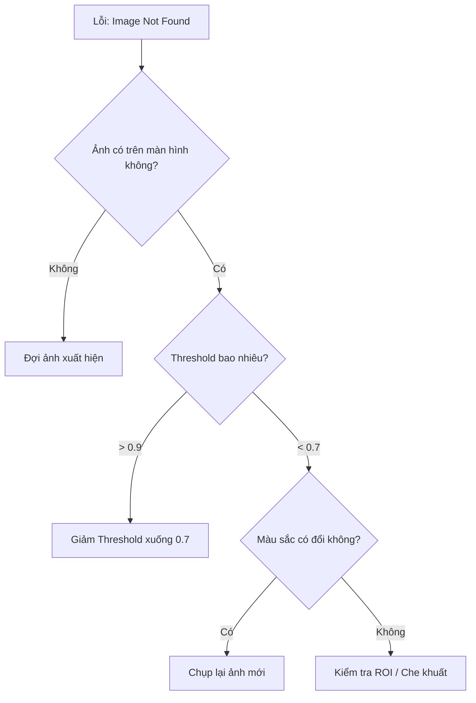

# Part 6: Troubleshooting (Xử Lý Sự Cố) 🔧
> *Bác sĩ cho bot của bạn.*

---

## 6.1 Diagnostic Decision Trees (Cây Chẩn Đoán) 🌳

### Case A: Image Not Found (Không tìm thấy ảnh)

### Case B: Script bị đơ (Hangs)

1.  **Kiểm tra `WaitImage`:** Bạn có để `timeout` vô hạn không? -> Thêm `timeout=10s`.
2.  **Kiểm tra Vòng lặp:** Có điều kiện thoát lặp không? (`break` hoặc `goto`).
3.  **Kiểm tra Interrupt:** Có Interrupt nào chạy liên tục không (spam log)? -> Tăng `cooldown`.

---

## 6.2 Common Error Encyclopedia (Từ điển Lỗi)

### 🔴 `RecursionError: maximum recursion depth exceeded`
- **Nguyên nhân:** Hai lệnh gọi nhau liên tục (A gọi B, B gọi A).
- **Lý do phổ biến:** Đặt tên `@flow` trùng với tên biến hoặc loop không thoát.
- **Giải pháp:** Kiểm tra lại logic `run_flow` và `goto`.

### 🟡 `ImageNotFoundError: 'btn_ok' not found`
- **Nguyên nhân:** Bot tìm hết thời gian `timeout` mà không thấy ảnh.
- **Giải pháp:**
    1.  Tăng `timeout` lên (mạng lag?).
    2.  Giảm `threshold`.
    3.  Chụp lại ảnh mẫu (Game update giao diện?).

### 🟠 `TesseractNotFoundError`
- **Nguyên nhân:** Chưa cài Tesseract OCR hoặc chưa set đường dẫn.
- **Giải pháp:** Xem lại [Part 1.3](./launchpad.md#13-installation--dependencies).

---

## 6.3 Log Analysis (Đọc Log)

Log file nằm tại: `C:\Users\<User>\.retroauto\logs\retroauto.log`

### Các mức độ Log (Levels)
- **DEBUG:** Chi tiết từng bước (Tìm ảnh mất bao nhiêu ms).
- **INFO:** Các sự kiện chính (Start script, Click, Find success).
- **WARNING:** Cảnh báo (Ảnh tìm thấy nhưng độ khớp thấp).
- **ERROR:** Lỗi không nghiêm trọng (Không tìm thấy ảnh nhưng script vẫn chạy tiếp).
- **CRITICAL:** Crash app.

> 💡 **Mẹo:** Khi báo lỗi cho Developer, hãy gửi kèm file log này.

---

> 👉 **Hết:** Bạn đã hoàn thành toàn bộ User Guide!
> [Quay về Mục lục](./README.md)
