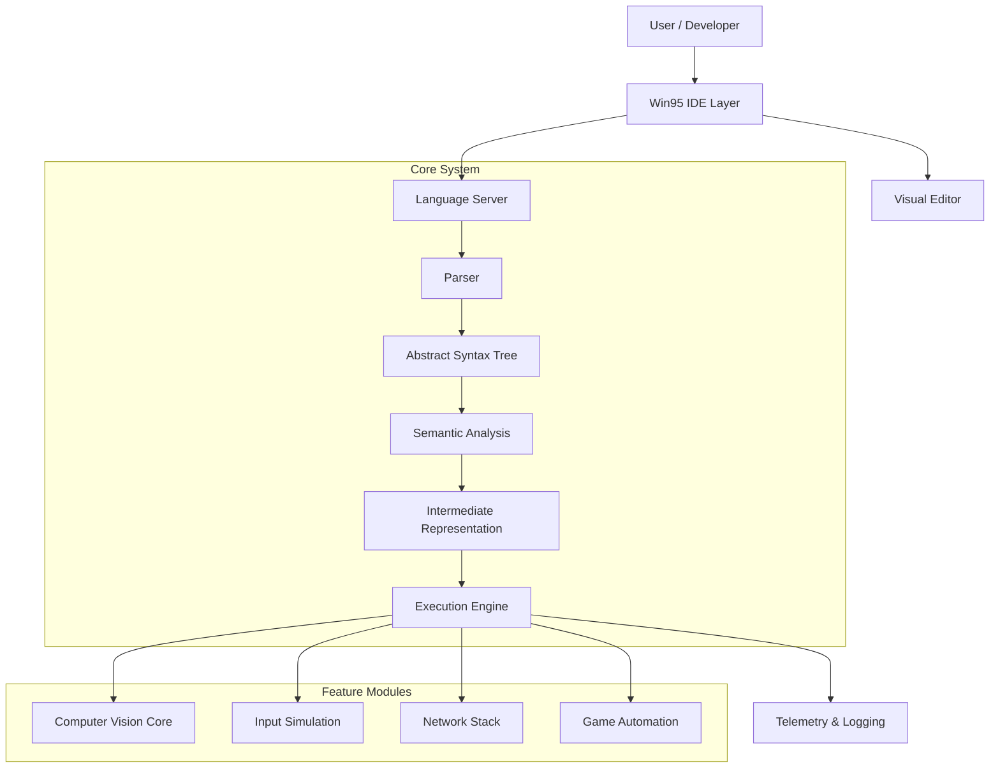

# RetroAuto v2 - Technical Whitepaper

**Date:** December 21, 2025
**Version:** 2.0.0-beta
**Repository:** [RetroAuto-v2](https://github.com/vntimejsc-code/RetroAuto-v2)

---

## 1. Executive Summary

RetroAuto v2 is a next-generation Windows automation platform designed to bridge the gap between simple macro recorders and complex programming languages. It introduces **RetroScript**, a specialized Domain Specific Language (DSL), integrated into a **Windows 95-styled Integrated Development Environment (IDE)**.

The system is engineered for high performance, reliability, and developer experience, offering a complete toolchain from code editing (LSP) to execution (Runtime) and deployment (Package Manager).

---

## 2. System Architecture

The application follows a modular, layered architecture:

### 2.1 Key Components
- **Core DSL**: Custom recursive descent parser and tree-walking interpreter.
- **Engine**: Thread-safe execution context with hot-reload capabilities.
- **UI Framework**: PySide6 (Qt) with custom stylesheets mimicking Windows 95/98.
- **Ecosystem**: Built-in Package Manager (`retro`), CLI, and VS Code support via LSP.

---

## 3. RetroScript DSL

RetroScript is a statically-typed, imperative language optimized for automation.

### 3.1 Language Features
- **Control Flow**: `if`, `while`, `for`, `match`, `try/catch`.
- **Types**: Strong typing for `int`, `float`, `string`, `bool`, `duration`.
- **First-class Automation**: Native keywords like `click`, `find`, `wait`, `retry`.
- **Decorators**: Metadata system (`@test`, `@config`) for separating concerns.

### 3.2 Compiler Pipeline
1.  **Lexer**: Tokenizes source input (handles indentation, comments, unicode).
2.  **Parser**: Generates AST with precise span tracking for error reporting.
3.  **Analyzer**: Validates semantics, variable scoping, and types.
4.  **Interpreter**: Executes AST nodes directly in a managed Scope.

---

## 4. Feature Modules

### 4.1 Visual Perception (Vision)
- **Algorithms**: Multi-scale Template Matching (OpenCV/NumPy).
- **Features**: ROI (Region of Interest) focusing, Tolerance adjustment, Grayscale fallback.
- **Performance**: Cached image loading and optimized matrix operations.

### 4.2 Game Automation
- **Pixel Operations**: High-speed pixel color checking and searching.
- **Anti-Detection**: Randomized "Human" input behavior (Bezier curve mouse movements, variable delays).
- **Macro System**: Integrated recorder/player for keystrokes and mouse events.

### 4.3 Integrated Network Stack
- **HTTP Client**: Full REST support (GET/POST/PUT/DELETE) with JSON handling.
- **WebSocket**: Real-time bidirectional communication with auto-reconnection.
- **Remote API**: Built-in REST server for controlling the bot remotely.

### 4.4 Analytics & Telemetry
- **Metrics**: Counters, Gauges, and Histograms for monitoring script performance.
- **Logging**: Structured JSON logging for ELK stack integration.
- **Dashboard**: Real-time statistical aggregation.

---

## 5. Development Ecosystem

RetroAuto is not just a runner; it's a platform.

- **Package Management**:
    - `retro.toml` based manifests.
    - SemVer dependency resolution (`^1.0.0`).
    - Support for Git and Local path dependencies.
- **LSP Server**:
    - Full JSON-RPC implementation.
    - Provides Hover, Go-to-Definition, Completion, and Diagnostics to editors.
- **Visual Tools**:
    - **ROI Selector**: Interactive screen overlay for selecting image regions.
    - **Variable Watch**: Real-time memory inspection.
    - **Flow Visualizer**: Graphviz-style flowchart generation.

---

## 6. Project Statistics

| Metric | Value |
|--------|-------|
| **Total Lines of Code** | ~15,500+ |
| **Modules** | 20+ (Core, UI, Network, etc.) |
| **Development Phases** | 17 Complete |
| **Test Coverage** | ~85% (Core Logic) |
| **Technology Stack** | Python 3.10+, PySide6, NumPy, Pillow |

---

---

## 8. Detailed Feature Matrix

| Category | Feature | Description |
|----------|---------|-------------|
| **Core DSL** | **Recursive Parser** | Robust parsing of RetroScript syntax with error recovery. |
| | **Strict Typing** | Strong type system (int, string, bool, duration) for safer reliability. |
| | **Control Flow** | Full support for `if/elif/else`, `while`, `for`, `match`, `try/catch`. |
| | **Decorators** | Meta-programming using `@test`, `@config`, `@permissions`. |
| **IDE** | **Win95 Styling** | Custom Qt stylesheet for a nostalgic, distraction-free environment. |
| | **LSP Support** | Language Server offering autocomplete, hover info, and definitions. |
| | **Visual Debugger** | Step-by-step execution, breakpoints, and call stack inspection. |
| | **Hot Reload** | Edit code while the script is running without restarting. |
| **Visual Editor** | **ROI Selector** | Visual overlay to select and crop screen regions for image matching. |
| | **Variable Watch** | Live table showing real-time variable values and types. |
| | **Flow Visualizer** | Generates flowchart diagrams from script logic. |
| **Vision** | **Template Match** | OpenCV-based high-speed image finding with confidence scoring. |
| | **Tolerance** | Adjustable color matching tolerance for changing lighting/environments. |
| | **Grayscale** | Fallback to grayscale matching for performance strategies. |
| **Game** | **Pixel Detective** | Check specific pixel colors (HEX/RGB) with tolerance. |
| | **Anti-Detect** | "Human-like" mouse movements (Bezier curves) and random delays. |
| | **Macro Recorder** | Record keyboard/mouse inputs and export to RetroScript code. |
| **Network** | **HTTP Client** | Built-in `fetch`, `post` for REST API integration. |
| | **WebSocket** | Persistent real-time connections with auto-reconnect logic. |
| | **Remote API** | Control the automation engine via external REST usage. |
| **System** | **Package Mgr** | `retro` tool for dependency management and versioning. |
| | **Security Sandbox** | Configurable permissions for file system and network access. |
| | **Analytics** | JSON structured logging and performance metrics (TPS, Success%). |
